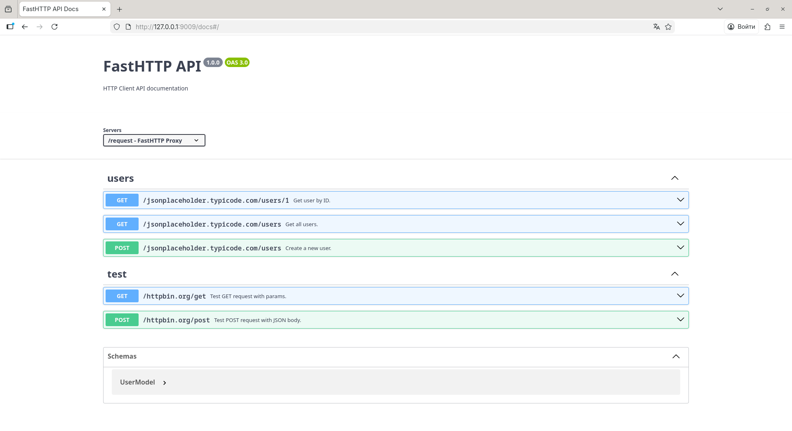
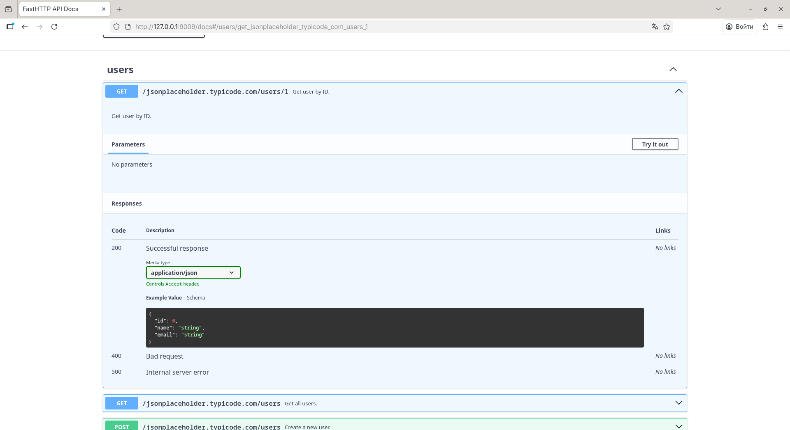
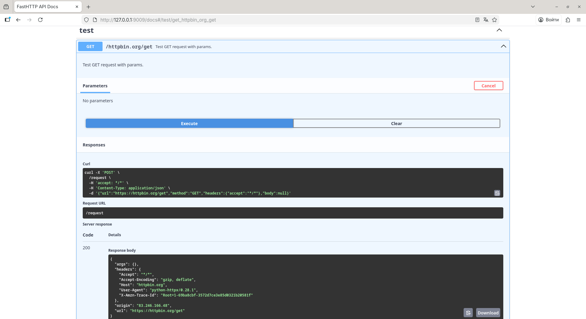

<p align="center">
  
</p>
<p align="center">
    <em>Fast, simple HTTP client with decorator-based routing, async support, and beautiful logging.</em>
</p>
<p align="center">
<a href="https://github.com/ndugram/fasthttp/actions/workflows/tests.yml" target="_blank">
    
</a>
<a href="https://pypi.org/project/fasthttp-client" target="_blank">
    
</a>
<a href="https://pypi.org/project/fasthttp-client" target="_blank">
    
</a>
<a href="https://codspeed.io/ndugram/fasthttp" target="_blank">
    
</a>
<a href="https://github.com/ndugram/fasthttp" target="_blank">
    
</a>
</p>

---

**Documentation**: <a href="https://fasthttp.ndugram.dev/ru/latest/" target="_blank">https://fasthttp.ndugram.dev/ru/latest/</a>

**Source Code**: <a href="https://github.com/ndugram/fasthttp" target="_blank">https://github.com/ndugram/fasthttp</a>

---

FastHTTP is a modern **async HTTP client library** for Python, built on top of **httpx**. It brings a decorator-based API — similar to FastAPI, but for outgoing requests — with structured logging, middleware, Pydantic validation, and a built-in Swagger UI.

Key features:

- **Fast** — built on <a href="https://www.python-httpx.org/" target="_blank">httpx</a> with full async support and parallel request execution.
- **Simple** — define HTTP requests as decorated async functions, no boilerplate.
- **Typed** — full type annotations throughout; validate responses with <a href="https://docs.pydantic.dev/" target="_blank">Pydantic</a> models.
- **Logged** — colorful, structured request/response logs with timing, built-in.
- **Complete** — GET, POST, PUT, PATCH, DELETE, and GraphQL out of the box.
- **Extensible** — middleware, dependency injection, routers, lifespan hooks.
- **Interactive** — built-in Swagger UI via `app.web_run()` to browse and execute requests in the browser.
- **HTTP/2** — optional HTTP/2 support, with automatic fallback to HTTP/1.1.

## Requirements

Python 3.10+

FastHTTP depends on:

- <a href="https://www.python-httpx.org/" target="_blank"><code>httpx</code></a> — async HTTP transport.
- <a href="https://docs.pydantic.dev/" target="_blank"><code>pydantic</code></a> — response model validation and serialization.
- <a href="https://github.com/ijl/orjson" target="_blank"><code>orjson</code></a> — fast JSON parsing.
- <a href="https://typer.tiangolo.com/" target="_blank"><code>typer</code></a> — CLI interface.
- <a href="https://www.uvicorn.org/" target="_blank"><code>uvicorn</code></a> — ASGI server for `web_run()`.

## Installation

```console
$ pip install fasthttp-client

---> 100%
```

## Example

### Create it

Create a file `main.py`:

```python
from fasthttp import FastHTTP
from fasthttp.response import Response

app = FastHTTP()


@app.get(url="https://httpbin.org/get")
async def get_data(resp: Response) -> dict:
    return resp.json()


if __name__ == "__main__":
    app.run()
```

### Run it

```console
$ python main.py
```

### Check it

You will see output like:

```
16:09:18.955 │ INFO     │ fasthttp │ ✔ FastHTTP started
16:09:19.519 │ INFO     │ fasthttp │ ✔ GET https://httpbin.org/get [200] 458.26ms
16:09:20.037 │ INFO     │ fasthttp │ ✔ Done in 1.08s
```

The `resp` object gives you access to status, headers, and body. `resp.json()` returns the parsed response:

```json
{
    "args": {},
    "headers": {
        "Accept": "*/*",
        "Host": "httpbin.org",
        "User-Agent": "python-httpx/0.28.1"
    },
    "origin": "...",
    "url": "https://httpbin.org/get"
}
```

### Interactive API docs

Replace `app.run()` with `app.web_run()`:

```python
from fasthttp import FastHTTP
from fasthttp.response import Response

app = FastHTTP()


@app.get(url="https://jsonplaceholder.typicode.com/users/1")
async def get_user(resp: Response) -> dict:
    return resp.json()


@app.post(url="https://jsonplaceholder.typicode.com/users")
async def create_user(resp: Response) -> dict:
    return resp.json()


if __name__ == "__main__":
    app.web_run()
```

Now go to <a href="http://127.0.0.1:8000/docs" target="_blank">http://127.0.0.1:8000/docs</a>.

You will see the automatic interactive API documentation:



Expand any route to inspect parameters, schemas, and expected responses:



Click **Try it out** to execute the request directly from the browser and see the real response:



### Upgrade the example

Now modify `main.py` to get more out of FastHTTP. Each upgrade below builds on the previous one.

<details markdown="1">
<summary>With Pydantic response models...</summary>

Declare a Pydantic model and pass it as `response_model`. FastHTTP will validate and parse the response automatically:

```python
from fasthttp import FastHTTP
from fasthttp.response import Response
from pydantic import BaseModel


class User(BaseModel):
    id: int
    name: str
    email: str


app = FastHTTP()


@app.get(
    url="https://jsonplaceholder.typicode.com/users/1",
    response_model=User,
)
async def get_user(resp: Response) -> User:
    return User(**resp.json())


if __name__ == "__main__":
    app.run()
```

</details>

<details markdown="1">
<summary>With multiple HTTP methods...</summary>

Register as many routes as you need across all HTTP methods. FastHTTP runs them concurrently:

```python
from fasthttp import FastHTTP
from fasthttp.response import Response

app = FastHTTP()


@app.get(url="https://httpbin.org/get")
async def get_data(resp: Response) -> dict:
    return resp.json()


@app.post(url="https://httpbin.org/post")
async def post_data(resp: Response) -> dict:
    return resp.json()


@app.put(url="https://httpbin.org/put")
async def put_data(resp: Response) -> dict:
    return resp.json()


@app.delete(url="https://httpbin.org/delete")
async def delete_data(resp: Response) -> int:
    return resp.status_code


if __name__ == "__main__":
    app.run()
```

</details>

<details markdown="1">
<summary>With routers...</summary>

Group related routes into a `Router` with a shared prefix or base URL, then include it into the app:

```python
from fasthttp import FastHTTP, Router
from fasthttp.response import Response

users_router = Router(prefix="https://jsonplaceholder.typicode.com")


@users_router.get(url="/users/1")
async def get_user(resp: Response) -> dict:
    return resp.json()


@users_router.get(url="/users/2")
async def get_user_two(resp: Response) -> dict:
    return resp.json()


@users_router.post(url="/users")
async def create_user(resp: Response) -> dict:
    return resp.json()


app = FastHTTP()
app.include_router(users_router)

if __name__ == "__main__":
    app.run()
```

</details>

<details markdown="1">
<summary>With middleware...</summary>

Intercept and modify requests before they are sent and responses after they are received:

```python
from fasthttp import FastHTTP
from fasthttp.middleware import BaseMiddleware
from fasthttp.response import Response


class LoggingMiddleware(BaseMiddleware):
    __priority__ = 0
    __methods__ = None
    __enabled__ = True

    async def request(self, method: str, url: str, kwargs: dict) -> dict:
        print(f"→ {method} {url}")
        return kwargs

    async def response(self, response: Response) -> Response:
        print(f"← {response.status}")
        return response


app = FastHTTP(middleware=[LoggingMiddleware()])


@app.get(url="https://httpbin.org/get")
async def get_data(resp: Response) -> dict:
    return resp.json()


if __name__ == "__main__":
    app.run()
```

</details>

<details markdown="1">
<summary>With dependency injection...</summary>

Use `Depends` to share logic across routes — auth tokens, computed headers, or any reusable setup:

```python
from fasthttp import FastHTTP, Depends
from fasthttp.response import Response
from fasthttp.types import RequestsOptinal


def auth_headers() -> RequestsOptinal:
    return {"headers": {"Authorization": "Bearer my-token"}}


app = FastHTTP()


@app.get(
    url="https://httpbin.org/get",
    dependencies=[Depends(auth_headers)],
)
async def get_data(resp: Response) -> dict:
    return resp.json()


if __name__ == "__main__":
    app.run()
```

</details>

<details markdown="1">
<summary>With lifespan...</summary>

Run setup and teardown logic around your requests using an async context manager:

```python
from contextlib import asynccontextmanager

from fasthttp import FastHTTP
from fasthttp.response import Response


@asynccontextmanager
async def lifespan(app: FastHTTP):
    print("Startup: loading credentials...")
    app.token = "my-secret-token"  # type: ignore[attr-defined]
    yield
    print("Shutdown: cleanup done.")


app = FastHTTP(lifespan=lifespan)


@app.get(url="https://httpbin.org/get")
async def get_data(resp: Response) -> dict:
    return resp.json()


if __name__ == "__main__":
    app.run()
```

</details>

<details markdown="1">
<summary>With GraphQL...</summary>

Use `@app.graphql` to send queries and mutations. The handler returns the query body; FastHTTP sends it and gives you the parsed response:

```python
from fasthttp import FastHTTP
from fasthttp.response import Response


app = FastHTTP()


@app.graphql(url="https://countries.trevorblades.com/graphql")
async def get_countries(resp: Response) -> dict:
    return {
        "query": """
            {
                countries {
                    name
                    code
                    capital
                }
            }
        """
    }


if __name__ == "__main__":
    app.run()
```

</details>

## Optional dependencies

- <a href="https://www.python-httpx.org/http2/" target="_blank"><code>httpx[http2]</code></a> — HTTP/2 protocol support.

```console
$ pip install fasthttp-client[http2]
```

Enable HTTP/2 per app instance:

```python
app = FastHTTP(http2=True)
```

Servers that don't support HTTP/2 fall back to HTTP/1.1 automatically.

## Contributing

Contributions are welcome! Please read the <a href="https://github.com/ndugram/fasthttp/blob/master/CONTRIBUTING.md" target="_blank">Contributing Guide</a> before opening a pull request.

Found a security issue? See the <a href="https://github.com/ndugram/fasthttp/blob/master/SECURITY.md" target="_blank">Security Policy</a>.

## License

This project is licensed under the terms of the <a href="https://github.com/ndugram/fasthttp/blob/master/LICENSE" target="_blank">MIT license</a>.
