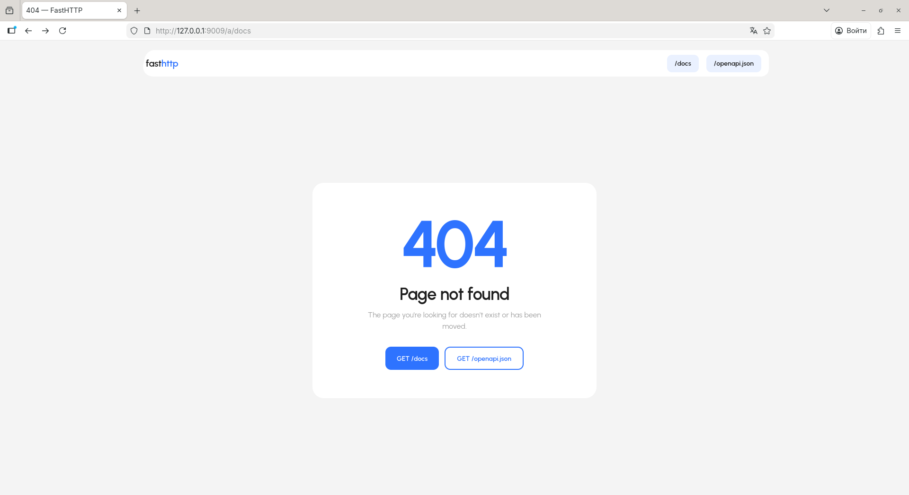

# OpenAPI и Swagger UI

FastHTTP включает встроенную поддержку OpenAPI и Swagger UI для удобного тестирования и документирования ваших HTTP-запросов.

## Что такое OpenAPI?

OpenAPI (ранее известный как Swagger) — это стандарт для описания REST API. Он позволяет:

- Автоматически генерировать документацию
- Тестировать API через удобный интерфейс
- Генерировать клиентские библиотеки
- Делиться документацией с командой

## Быстрый старт

Запустите ваше приложение с методом `web_run()`:

```python
from fasthttp import FastHTTP
from fasthttp.response import Response

app = FastHTTP()

@app.get("https://httpbin.org/get")
async def get_data(resp: Response) -> dict:
    return resp.json()

app.web_run()
```

После запуска откройте в браузере:
- **Swagger UI**: `http://127.0.0.1:8000/docs`
- **OpenAPI Schema**: `http://127.0.0.1:8000/openapi.json`

## Доступные endpoints

| Endpoint | Описание |
|----------|----------|
| `/docs` | Swagger UI интерфейс |
| `/openapi.json` | OpenAPI схема в JSON формате |
| `/request` | Прокси для выполнения запросов |

## Использование Swagger UI

### Просмотр документации

Все ваши HTTP-запросы автоматически отображаются в Swagger UI с:
- Методом HTTP (GET, POST, PUT, DELETE)
- URL адресом
- Описанием из docstring
- Параметрами запроса
- Моделями ответа Pydantic

### Тестирование запросов

1. Найдите нужный endpoint в списке
2. Нажмите на него чтобы раскрыть
3. Нажмите кнопку **"Execute"**
4. Просмотрите ответ в разделе **Response**

Swagger автоматически перенаправит запрос через внутренний прокси на оригинальный URL.

## Примеры

### Простой GET запрос

```python
@app.get("https://jsonplaceholder.typicode.com/users/1")
async def get_user(resp: Response) -> dict:
    return resp.json()
```

### POST с JSON телом

```python
@app.post("https://jsonplaceholder.typicode.com/users")
async def create_user(resp: Response) -> dict:
    return resp.json()
```

### С Pydantic моделью

```python
from pydantic import BaseModel

class User(BaseModel):
    id: int
    name: str
    email: str

@app.get("https://jsonplaceholder.typicode.com/users/1", response_model=User)
async def get_user(resp: Response) -> dict:
    return resp.json()
```

## Настройка

### Кастомный хост и порт

```python
app.web_run(host="0.0.0.0", port=8080)
```

### С тегами

```python
@app.get("https://api.example.com/data", tags=["users"])
async def get_data(resp: Response) -> dict:
    return resp.json()
```

## Скриншоты

### Swagger UI Главная


### Выполнение запроса


### Просмотр ответа


### Страница 404



## см. также

- [Быстрый старт](ru/quick-start.md)
- [Pydantic валидация](ru/pydantic-validation.md)
- [Примеры](ru/examples.md)
